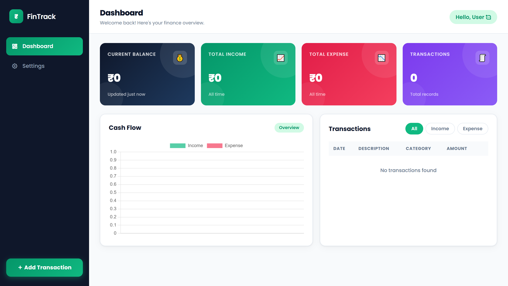

# 💰 FIN TRACKER WEB APP

<p align="center">
  
</p>

<p align="center">
  <strong>A modern and responsive Personal Finance Tracker built using HTML, CSS, and Vanilla JavaScript.</strong>
</p>

<p align="center">
Track your income and expenses, monitor your balance, and manage your daily finances with a clean and intuitive interface.
</p>

---

## 🚀 Live Demo

👉 **https://fin-tracker-web-app.vercel.app/**

## 📂 GitHub Repository

👉 **https://github.com/Mashaallah12/FIN-TRACKER-WEB-APP**

---

# ✨ Features

* 💰 Add Income & Expense Transactions
* 📊 Automatic Balance Calculation
* ✏️ Edit Existing Transactions
* 🗑️ Delete Transactions
* 🔍 Search Transactions
* 🏷️ Organize by Categories
* 📅 Date Support
* 💾 Local Storage (Data remains after refresh)
* 📱 Fully Responsive Design
* ⚡ Fast & Interactive User Experience
* 🎨 Clean and Modern UI

---

# 🛠 Tech Stack

* HTML5
* CSS3
* JavaScript (ES6)
* Local Storage API

---

# 📸 Project Preview

<p align="center">
  
</p>

---

# 📂 Folder Structure

```text
FIN-TRACKER-WEB-APP/
│
├── assets/
├── index.html
├── style.css
├── script.js
├── screenshort.png.png
└── README.md
```

---

# 🚀 Getting Started

### Clone the Repository

```bash
git clone https://github.com/Mashaallah12/FIN-TRACKER-WEB-APP.git
```

### Move into the Project Folder

```bash
cd FIN-TRACKER-WEB-APP
```

### Run the Project

Simply open **index.html** in your preferred web browser.

No installation or additional dependencies are required.

---

# 🎯 What I Learned

This project helped me improve my understanding of:

* DOM Manipulation
* Event Handling
* CRUD Operations
* JavaScript Arrays & Objects
* Local Storage
* Responsive Web Design
* Clean UI Development
* JavaScript Best Practices

---

# 🔮 Future Improvements

* 📈 Expense Analytics & Charts
* 🌙 Dark Mode
* 📤 Export Transactions (PDF/CSV)
* ☁️ Cloud Database Integration
* 👤 User Authentication
* 💱 Multi-Currency Support
* 📅 Monthly Reports & Insights

---

# 🤝 Contributing

Contributions, suggestions, and improvements are always welcome.

1. Fork this repository
2. Create a new branch
3. Make your changes
4. Commit your changes
5. Open a Pull Request

---

# 👨‍💻 Author

**Mashaallah Mohammad**

Frontend Developer

GitHub: https://github.com/Mashaallah12

---

# ⭐ Support

If you found this project useful or inspiring, please consider giving it a **⭐ Star** on GitHub.

Your support motivates me to build more real-world projects.

---

## 💙 Built with HTML, CSS & Vanilla JavaScript

<p align="center">
  <strong>Track Better • Save Smarter • Build Consistently 🚀</strong>
</p>
